					!!IMPORTANTE!!
	El siguiente post esta enfocado para el publico en general y no tecnico 
	, por ello los terminos utlizados pueden estar mal empleados o definidos.

En este post esta enfocado en enseñar de forma facil como realizar una revision de tu computador de forma facil 
, gratuita y segura todo los archivos y procesos que estan en tu computador.

SILABUS:
	-Provehedor de seguridad,casa de antivirus: son aquellas empresas dedicadas a crear y actualizar antivirus.
	-VirusTotal: empresa dedicada a juntar los mejores casas de antivirus para poder verificar la seguridad de Archivos.
	-Process Explorer:Herramienta gratuita desarrollada por "Microsoft Sysinternals", el cual muestra 
	de forma mas minuciosa los procesos y archivos que tienes en un computador.  
	
Comencemos!!
Si uno quiere puede usar la pagina de virus total , solo es necesario arrastrar 
el o los archivos e incluso url de archivos para poder ver la seguridad de estos.
	"https://www.virustotal.com/gui/home/upload"

--------------------------------------
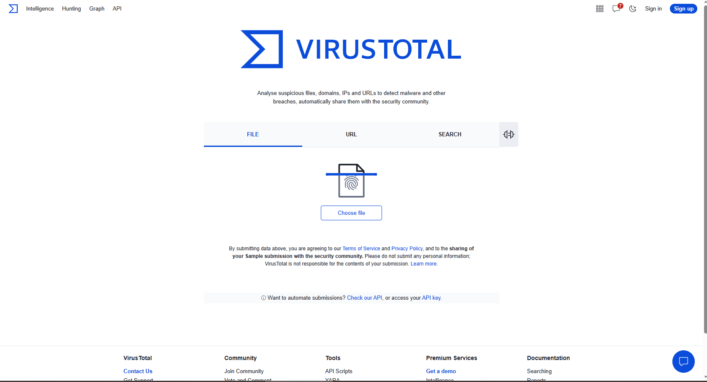
--------------------------------------
pero esto seria muy engoroso ya que tendrias que estar arrastando todos los archivos y mira tu 
cuando terminariamos, y pero hay una manera de poder automatizar esto y es utilizando el Process Explorer 
tengamos en cuenta que esta herramienta es de microsoft y "NO DE TERCEROS".
Agamos lo siguiente , nos vamos a la siguiente pagina para descargar esta herramienta:
	https://learn.microsoft.com/en-us/sysinternals/downloads/process-explorer

------------------------------------
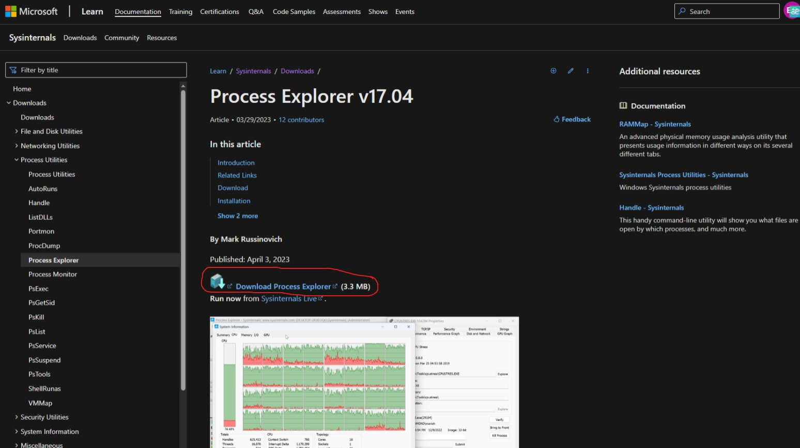

------------------------------------
seleccionamos lo que esta dentro de circulo rojo y descargamos , luego segun cada uno , pedira o no descargar en una carpeta,
identificamos la carpeta y luego vemos el archivo ProcessExplorer.zip , damos anticlick y lo descomprimimos.

----------------------------------------
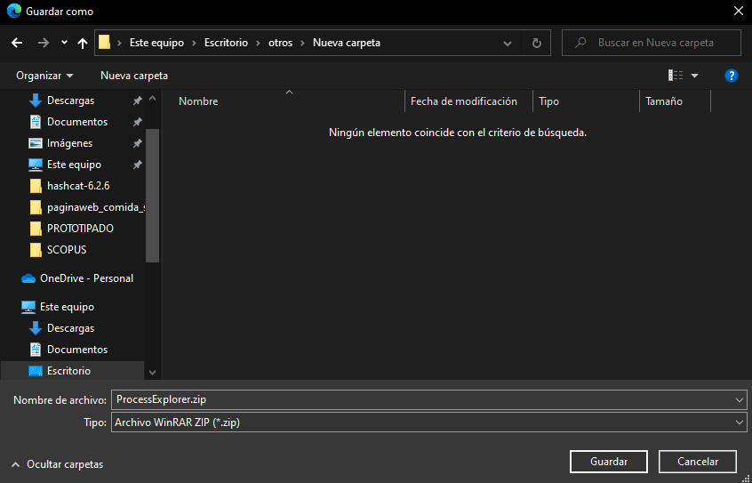

--------------------------------
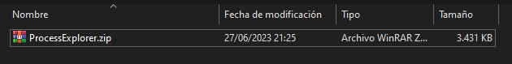

--------------------------------
ahora ejecutamos el arcivo llamado procexp64.exe 

--------------------------------
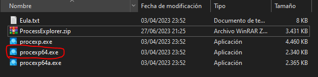

--------------------------------
este te mostrara una aviso el cual aceptamos

--------------------------------
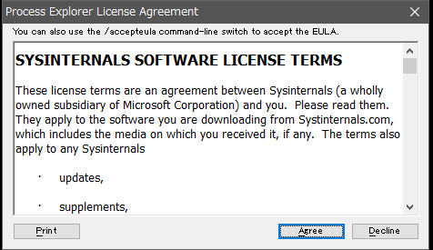

--------------------------------
luego nos aparecera el programa , varia segun el computador pero si vemos tiene los siguientes informacion

--------------------------------
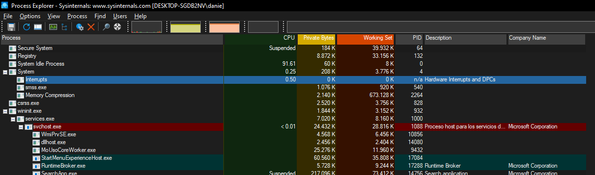

--------------------------------
lo que nos importa es ir al apartado de "options-VirusTotal.com"

--------------------------------
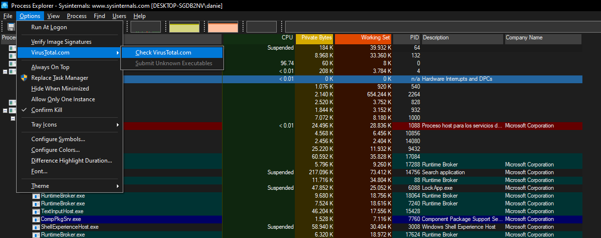

--------------------------------
ahora vemos que nos esta mostrando un apartado llamado VirusTotal (LADO DERECHO)

--------------------------------
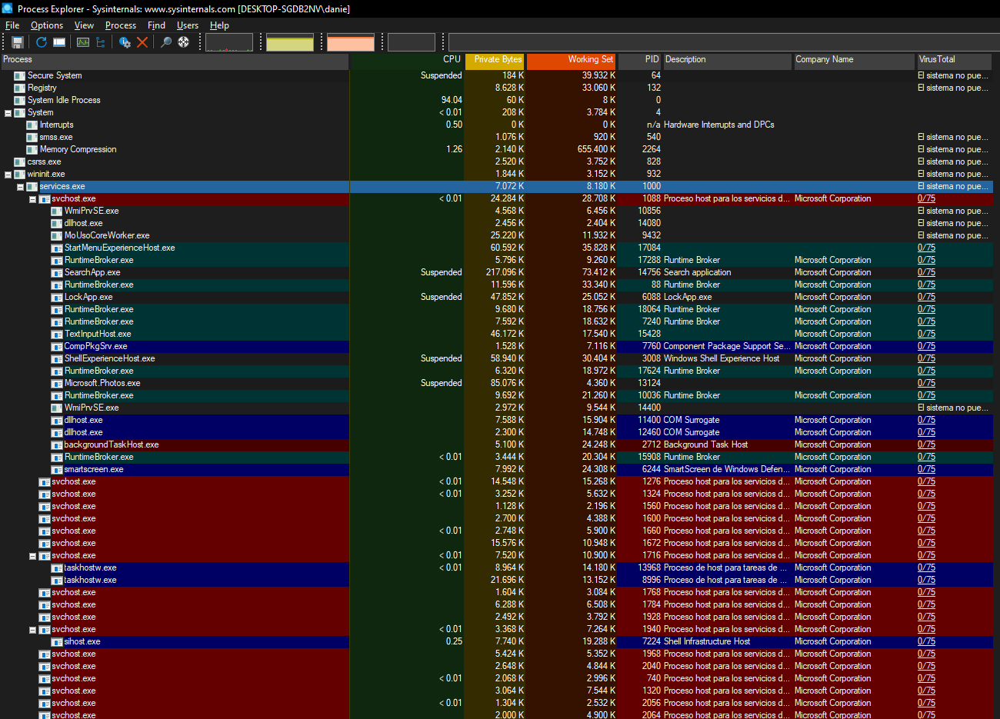

--------------------------------
, el cual tiene un formato NUMERO/74 , el numero indica la cantidad de antivirus que an reportado que el archivo 
es un posible virus, en mi caso te todos los archivos execto uno me marco 0/74 , lo cual me indica que todos los antivirus indican 
que no tengo virus en mi computador , pero si en tu caso alguno de estos de salio (15 o más)/74 , significa que posiblemente 
tengas un virus actualmente en tu computador y que posiblemente te esten robando informacion,cuentas bancarias,redes sociales,etc.

------------------------------------------------
	MEDIDAS A TOMAR(SOLUCIONES)
------------------------------------------------

-NO DESCARGES PROGRAMAS PIRATAS.

-Eliminaremos el virus: 

damos click derecho al archivo y vamos a properties 

--------------------------------
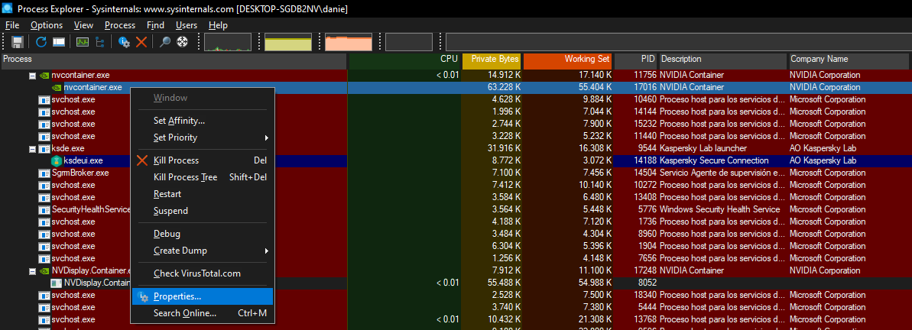

--------------------------------
, luego copiamos lo que esta debajo del path ,

--------------------------------
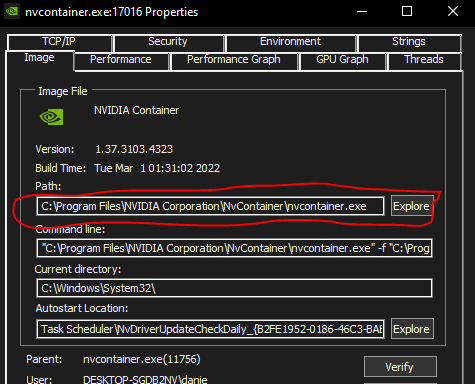

--------------------------------
vamos a mi pc copiamos aqui pero borramos la ultima parte el cual corresponde al nombre del archivo y asi solo nos quedaria 
la ubicacion del virus, dependiendo de la carpeta puede haber 1 o muchos archivos aqui dentro lo importante es 
buscar el nombre del archivo el cual es esta parte que borramos,

----------------------------------
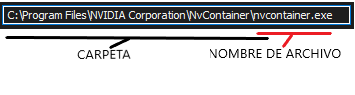

----------------------------------
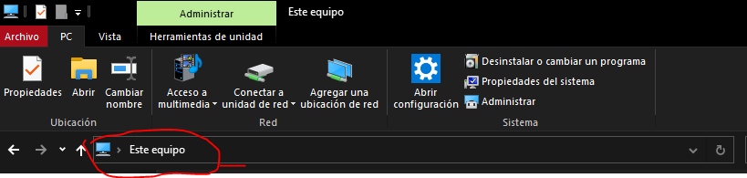

----------------------------------
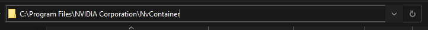

----------------------------------
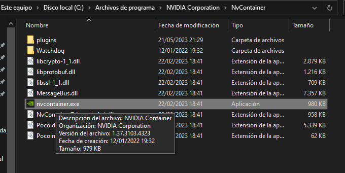

----------------------------------

	!!IMPORTANTE!!
	Tengamos en cuenta que por alguna razon x puede ser esto un archivo importante del sistema
	por lo cual tengamos un poco de cuidado al eliminarlo ya que podemos afectar seriamente al sistema 

luego esperamos un momento aqui y regresamos a la ventana del Process Explorer 
buscamos otra vez el archivo detectado como virus
damos anticlick y ahora vamos a buscar la opcion que diga "KILL PROCESS" y damos click

----------------------------------
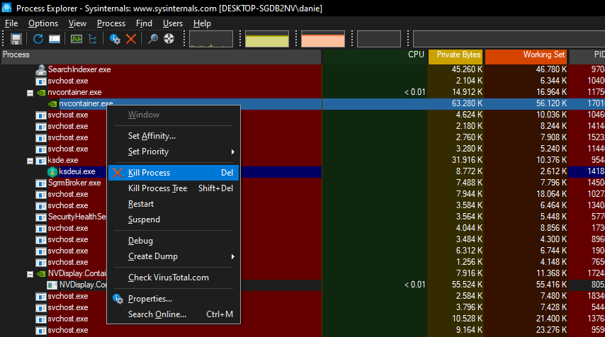

----------------------------------
luego volvemos a la carpeta donde esta el archivo y lo eliminamos tambien

----------------------------------
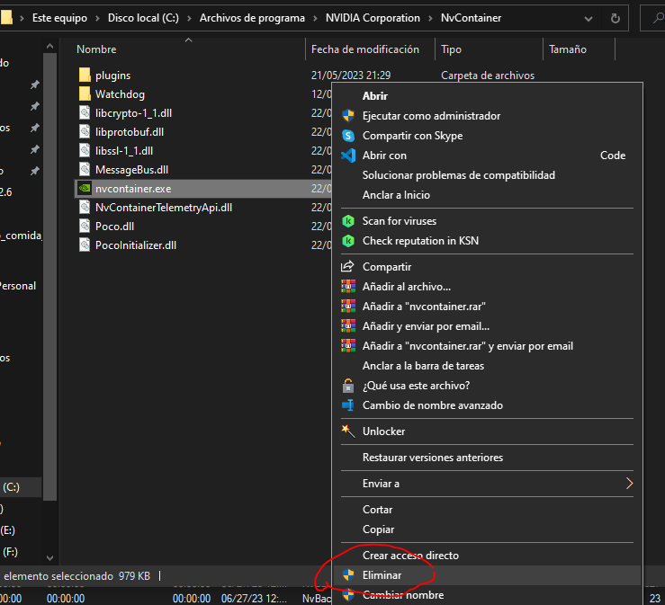

----------------------------------
y con esto ya estaria.

	```tener en cuenta que sigamos revisando los demas y por lo menos 
	1 vez a la semana para ver si existen otros virus y en caso persista mandar a formatear el sistema con un tecnico.```
 
