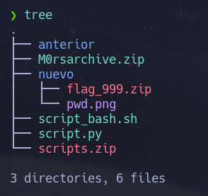
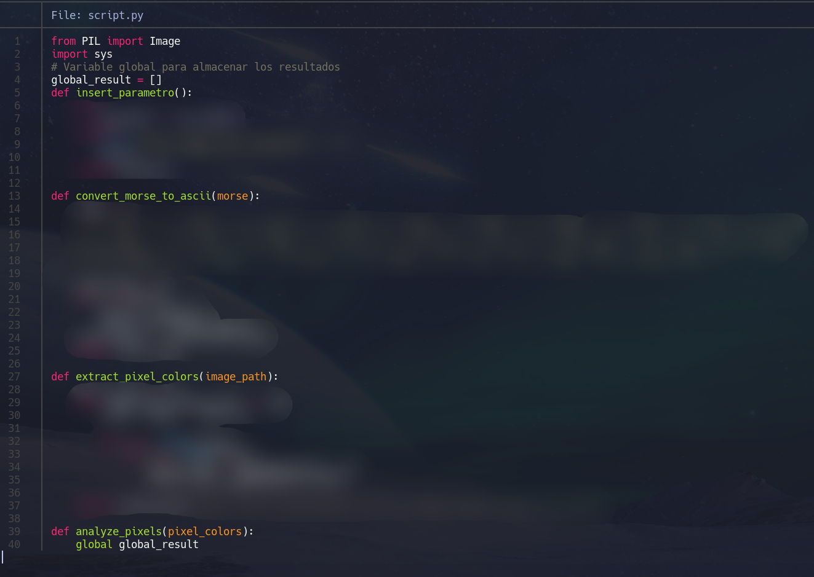
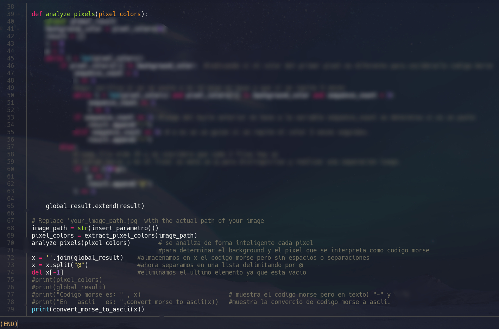
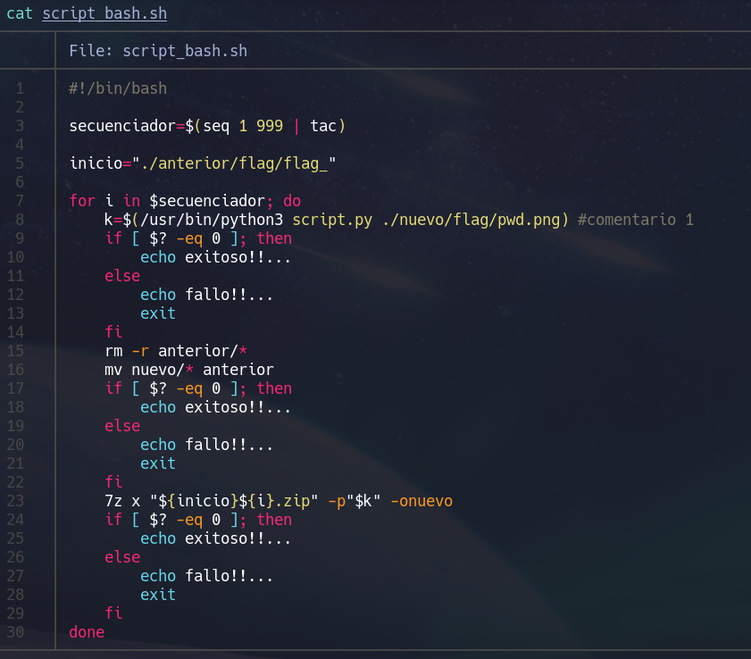

Resolucion de challenges-Morsarchive

***	Primeramente de dejo un zip el cual tiene todos los scritps y la contraseña es la flag.

***	[Scripts.zip](../assets/posts2/scripts.zip).

***	Ahora para que te pueda funcionar mi script debes de tener una estructura de archivos como:

El ejercicio trata de archivos comprimidos redundandetemente 999 veces y las contraseñas se almacenan en una
imagen llamado pwd.png el cual tiene en sus pixeles pintados en codigo morse el cual se tienes que traspazar a 
ascci para obtener la contraseña del proximo zip.

# Script_de_python

No puedo mostrar la resolucion completa ya que es un challegens activo.

## Script_bash

##TENER EN CUENTA QUE ESTE SCRIPT TE LO DESCOMPRIME HASTA EL COMPRIMIDO 0 , LUEGO DE ELLO DE FORMA MANUAL TENDRAS QUE DESCOMPRIMIR
##Y DIRIGIRTE A LA CARPETA LLAMADA FLAG DONDE LO GUARDES Y AHI SE ENCONTRARA UN ARCHIVO LLAMADA: HTB{***************}

